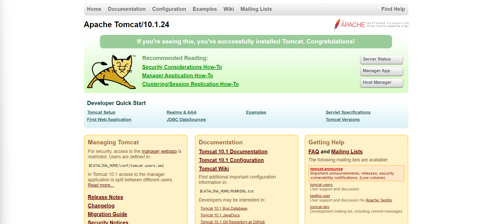

# Tomcat. Установка. Альтернативы

В этой статье мы начнем знакомство с конечными инструментами, на которых в дальнейшем будем запускать серверные
приложения - речь пойдет о контейнерах сервлетов. Так, мы кратко познакомимся с некоторыми из реализаций, а также
установим наиболее популярный из них. Как и когда-то с СУБД, дальнейшие статьи будут связаны с конфигурацией и
использованием сервера, который сегодня будет установлен.

## Обзор

В современном Java-мире можно выделить три наиболее популярных имплементации контейнера сервлетов:

1. Apache Tomcat;
2. Jetty;
3. Undertow.

Ниже чуть более подробно познакомимся с каждой из них и попытаемся сравнить.

> На самом деле реальная ценность сравнительной характеристики в разрезе данного курса сомнительна - и
> представителю целевой аудитории этой статью, и не-сеньор разработчику в принципе редко приходится задумываться о
> выборе инструмента такого уровня - нет ни полномочий, ни знаний, ни достаточного опыта, чтобы сравнивать серверы с
> прицелом на целевое приложение, которое будет на этом сервере работать.
>
> Поэтому своей задачей я вижу, в первую очередь, дать основные реализации и наиболее запоминающиеся характеристики
> каждой из них, чтобы выстроить хоть какой-то ассоциативный ряд при словосочетании "контейнер сервлетов".
>
> Возможно, это поможет выиграть несколько очков на техническом собеседовании, что всегда ценно для начинающего
> специалиста.

### Apache Tomcat

Первый из представленных вариантов - Apache Tomcat (чаще просто Tomcat) - наиболее популярный инструмент, который мы и
будем использовать далее. И популярность - его основной плюс. Он во многом менее гибок в настройке и почти во всем -
наименее производительный из текущего списка, но зато крайне прост в установке и использовании. Кроме того, за счет
огромной популярности можно быстро найти решения типовых проблем, что крайне важно для новичков.

Также стоит отметить, что Tomcat является сервером по умолчанию для Spring Boot - одной из основных составляющих
фреймворка Spring, с которым мы будем знакомиться в следующих разделах.

Скорее всего, со временем и опытом у вас появятся собственные предпочтения и аргументы в пользу какого-либо из
контейнера сервлетов или другой платформы для серверных приложений. Пока же - Tomcat лучший выбор для новичков.

### Jetty

Легковесный контейнер сервлетов, более производительный, чем Tomcat, но намного менее популярный. Что является
наиболее существенным недостатком на данном этапе. В целом, достаточно прост в конфигурации, в чем-то даже более
дружелюбен, чем Tomcat. Но встретить его на реальном проекте - редкость.

Яркой особенностью данного решения является то, что оно полностью написано на Java.

### Undertow

Наиболее производительный из рассматриваемых сегодня контейнеров сервлетов. Известен, во многом, благодаря
поддержке асинхронной обработки запросов. Строго говоря, такую возможность предоставляет и Tomcat
(с определенной версии), и Jetty, но именно у Undertow это подчеркивается как конкурентное преимущество.

Кроме того, характерной особенностью Undertow является то, что этот продукт тесно связан с Red Hat (ранее
разрабатывался JBoss)*. Обе эти компании широко известны как производители ПО (вплоть до собственного дистрибутива
Linux), в т.ч. продуктов, реализующих спецификации Java EE.

> *Сам Red Hat был поглощен другим IT-гигантом - IBM.

Так, JBoss в свое время разработал один из наиболее известных application server'ов - WildFly. Который, в свою
очередь, использует Undertow в качестве контейнера сервлетов (и в более широком смысле - веб-сервера) по умолчанию.

Несмотря на все вышесказанное, Undertow уступает по популярности Tomcat и Jetty. Кроме того, он менее дружелюбен в
конфигурации.

## Установка Tomcat

Установка Apache Tomcat возможна как посредством распаковки архива с дальнейшей конфигурацией приложения (для любой
ОС), так и через специальную программу установщик (для Windows). Оба варианта достаточно просты, скачать можно здесь:
[ссылка](https://tomcat.apache.org/download-10.cgi). Но вариант с установочным приложением выглядит более
дружелюбным для новичков.

Подробная инструкция кажется избыточной, все, что требуется:

1. В случае с установочником - лишь запустить exe-файл, в специальных окнах указать локацию JDK и директорию для
   установки самого Tomcat. Остальные пункты можно оставлять по умолчанию;
2. В случае с архивом - распаковать и следовать инструкции по установке и запуску, точную локацию самой инструкции
   можно найти в `README.md` внутри архива. Обычно - `RUNNING.txt`.

Несколько нюансов при установке и первом запуске на Windows:

- Не стоит располагать JDK в скрытой директории. Это особенно актуально, если JDK вы устанавливали через IDEA - по
  умолчанию JDK будут скачиваться в папку `${userHome}/.jdks`. Это может привести к тому, что Tomcat не сможет
  получить доступа к JDK;
- Не стоит устанавливать Tomcat в каталоги вроде `Program Files`. На них могут стоять ограничения (скажем, только
  для Администратора), что тоже может затруднить дальнейший доступ к серверу;
- При возникновении проблем с запуском стоит проверить содержимое лог-файлов. Их можно найти по
  адресу `${userHome}/.jdks/logs`. При проблемах с запуском сервера стоит в первую очередь проверять содержимое
  файла с `commons-daemon` в названии.

После успешной установки и запуска сервера можно убедиться в успешности мероприятия. Достаточно открыть в браузере
`http://localhost:8080/` (или другой порт, если вы заменили стандартный в процессе установки/конфигурации). Должна
открыться страница, похожая на эту:

Если это произошло - поздравляю, установка и запуск прошли успешно.

Если Tomcat не был добавлен в приложения с автозапуском, вы всегда можете стартовать его вручную через
соответствующий `.exe`/`.bat`/`.sh` файл - в зависимости от ОС и предпочтительного способа запуска.

#### На сегодня все!

> Если что-то непонятно или не получается – welcome в комменты к посту или в лс:)
>
> Канал: https://t.me/ViamSupervadetVadens
>
> Мой тг: https://t.me/ironicMotherfucker
>
> **Дорогу осилит идущий!**

[Next Lesson](../142/Servlet%20API.%20Introduction.md)
